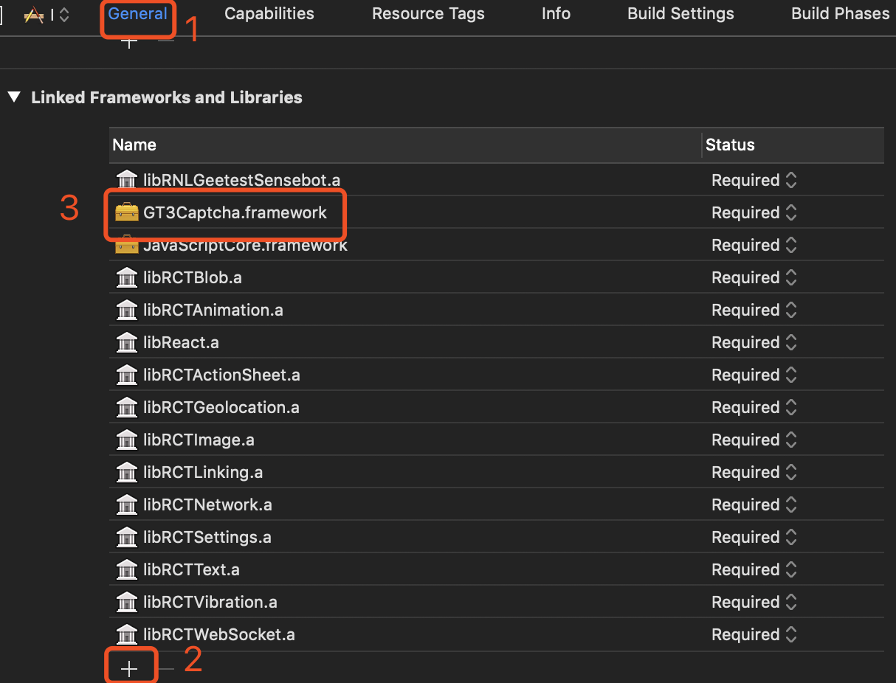

# react-native-geetest-sensebot

[GEETEST极验行为验证](https://docs.geetest.com/install/overview/start/) [](https://www.npmjs.com/package/@yyyyu/react-native-geetest-sensebot)

**SDK Version**
iOS: v0.11.7_20190314
Android: v4.0.7_20190311

**测试环境**
Xcode 10.2.1
react-native 0.59.5

## Getting Started

```bash
yarn add @yyyyu/react-native-geetest-sensebot
# or
npm i @yyyyu/react-native-geetest-sensebot --save
```

```bash
react-native link @yyyyu/react-native-geetest-sensebot
```

### iOS 不使用 CocoaPods

在 Linked Frameworks and Libraries 中添加 node_modules/@yyyyu/react-native-geetest-sensebot/ios/SDK/GT3Captcha.framework



### Android

在 AndroidManifest.xml 文件中添加权限

```xml
// ...
<uses-permission android:name="android.permission.INTERNET" />
<uses-permission android:name="android.permission.ACCESS_WIFI_STATE" />
<uses-permission android:name="android.permission.ACCESS_NETWORK_STATE" />
<uses-permission android:name="android.permission.READ_PHONE_STATE" />
```

## Example

```javascript
import React, { Component } from 'react'
import { View, Button } from 'react-native'
import * as RNGeetestSensebot from '@yyyyu/react-native-geetest-sensebot'

export default class App extends Component {
  geetest = async () => {
    let api1Result
    try {
      const api1Response = await fetch('http://www.geetest.com/demo/gt/register-test')
      api1Result = await api1Response.json()
    } catch (e) {
      return console.log('API1 request failed, message: %s.', e.message)
    }

    let geetestResult
    try {
      geetestResult = await RNGeetestSensebot.start({
        api1Result,
        // optional default false
        debug: true,
        // optional default 10s
        loadTimeout: 10000,
        // optional default 10s
        reqTimeout: 10000,
        // optional default system
        lang: RNGeetestSensebot.Lang.System,
        // optional default false
        enableBackgroundCancel: true,
        // optional default transparent
        backgroundColorIOS: 'red',
        // optional default none
        backgroundBlurEffectIOS: RNGeetestSensebot.BackgroundBlurEffectIOS.Regular,
        // optional
        onEvent: (code, data) => {
          if (code === RNGeetestSensebot.Events.FAILED) {
            console.log('Validate failed, reason: %s', data[0])
          } else {
            console.log(RNGeetestSensebot.Events[code], data)
          }
        }
      })
    } catch (e) {
      return console.log('Error, code: %d, message: %s.', e.code, e.message)
    }

    let api2Result
    try {
      const api2Response = await fetch('http://www.geetest.com/demo/gt/validate-test', {
        method: 'POST',
        headers: { 'Content-Type': 'application/json;charset=UTF-8' },
        body: JSON.stringify(geetestResult)
      })
      api2Result = await api2Response.json()
    } catch (e) {
      return console.log('API2 request failed, message: %s.', e.message)
    }

    console.log('Validate result: %o.', api2Result)
  }

  render() {
    return (
      <View style={{ flex: 1, justifyContent: 'center', alignItems: 'center' }}>
        <Button title='StartGeetest' onPress={this.geetest} color='#26c6aa' />
      </View>
    )
  }
}
```

## Option

```javascript
export interface IOption {
    // API1
    api1Result: IAPI1Result;
    // debug
    debug?: boolean;
    // view 加载超时时间，默认10000
    loadTimeout?: number;
    // 第二步向极验服务器发送请求超时时间，默认10000
    reqTimeout?: number;
    // 语言，如果为null则使用系统默认语言
    lang?: Lang;
    // 点击背景是否可以取消验证
    enableBackgroundCancel?: boolean;
    // 背景色 IOS Only
    backgroundColorIOS?: any;
    // 背景模糊类型 IOS Only
    backgroundBlurEffectIOS?: BackgroundBlurEffectIOS;
    // 事件监听
    onEvent?: (code: Events, data?: Array<number | string>) => void;
}

export interface IAPI1Result {
    success: 0 | 1;
    challenge: string;
    gt: string;
    new_captcha: boolean;
    [key: string]: any;
}

export enum Lang {
    System = "system", // 跟随系统
    ZH = "zh", // 简体中文
    ZH_TW = "zh-tw", // 繁体中文
    ZH_HK = "zh-hk", // 繁体中文
    EN = "en", // 英语
    ID = "id", // 印尼语
    JA = "ja", // 日语
    KO = "ko", // 韩语
    RU = "ru", // 俄语
    AR = "ar", // 阿拉伯语
    ES = "es", // 西班牙语
    PT_PT = "pt-pt", // 葡萄牙语
    FR = "fr", // 法语
    DE = "de", // 德语
}

export enum BackgroundBlurEffectIOS {
    None = -1,
    ExtraLight = 0,
    Light,
    Dark,
    Regular, // NS_ENUM_AVAILABLE_IOS(10_0)
    Prominent, // NS_ENUM_AVAILABLE_IOS(10_0)
}

export enum Events {
    // 验证结果
    RESULT = 1,
    // 验证窗口关闭
    CLOSED = 2,
    // 验证失败
    FAILED = 3,
    // 发生错误
    ERROR = 0,
}

export enum Errors {
    // 参数解析错误
    PARAMETER_PARSE_FAILED = -1,
    // 安卓 activity 已经销毁
    ANDROID_ACTIVITY_DESTROYED = -2,
    // 重复启动
    DUPLICATE_START = -3,
}

export interface IResult {
    geetest_challenge: string;
    geetest_seccode: string;
    geetest_validate: string;
    [key: string]: any;
}
```
